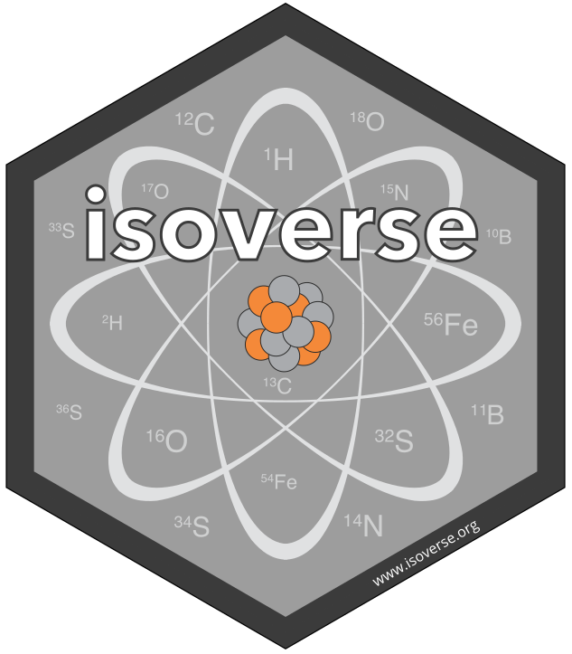

# isoverse logos 

If you like the functionality that isoverse provides, please help us spread the word by including an isoverse logo on one of your posters or slides. All logos are released under a creative commons lincense ([CC0](LICENSE.md)) and are available as SVG vector graphics and high resolution PNG files as linked below.

## SVG logos

```{r, results = "asis", echo = FALSE}
fig_file <- dir(path = "SVG", pattern = "svg$") 

glue::glue('<a href="SVG/{fig_file}"></a> ')
```

## PNG logos

```{r, results = "asis", echo = FALSE}
fig_file <- dir(path = "PNG", pattern = "png$")

glue::glue('<a href="PNG/{fig_file}"></a> ')
```

