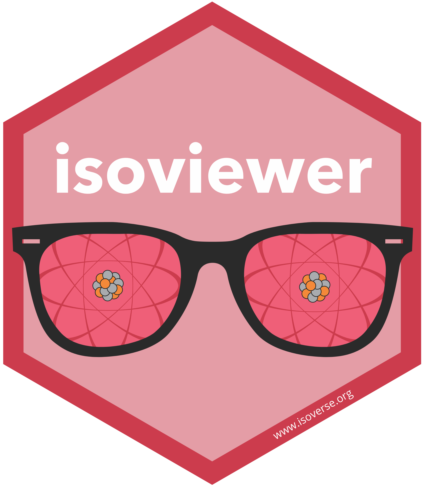

# isoverse hex stickers 

If you like the functionality that isoverse provides, please help us
spread the word by including an isoverse logo on one of your posters or
slides. All logos are released under a creative commons lincense
([CC0](LICENSE.md)) and are available as SVG vector graphics and high
resolution PNG files as linked
below.

## SVG logos

## PNG logos

